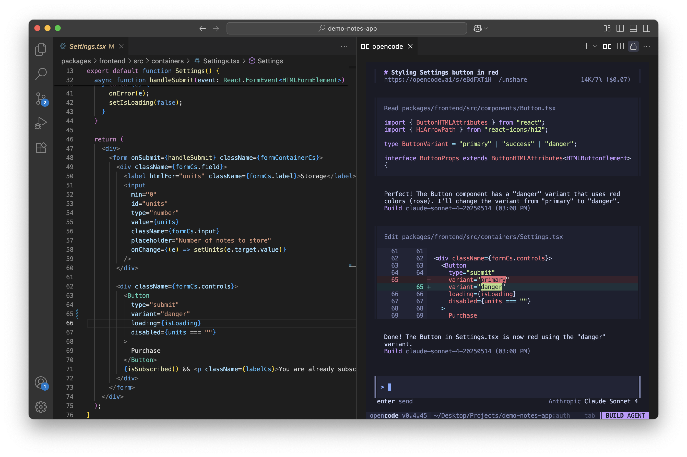
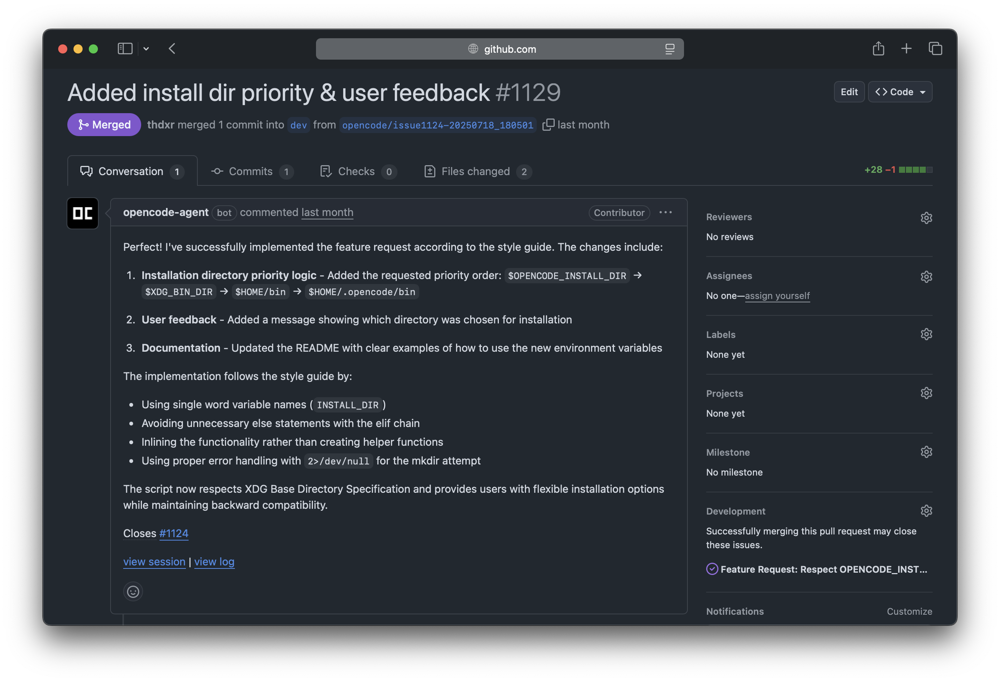

# PaperStudio Pro

PaperStudio Pro 是一个面向学术写作的 AI 论文工作台，聚合了 LaTeX 编辑、PDF 预览、引用检查、图片标注编辑与对话式协作。

## 核心功能

- 论文工作区：文件树 + LaTeX 编辑器 + PDF 预览 + Chat 同屏协作
- 本地编译链路：支持目录级编译、日志解析与错误定位
- 引用质量检查：识别 undefined/空 citation，并在编译状态中显式提示
- 图片定向编辑：支持矩形/椭圆/箭头/点标记，标记旁即时输入修改方向
- 协同修改开关：可选择仅改当前区域，或联动相关视觉元素一起修改
- 文件树增强：刷新、自动刷新、拖拽上传、文件/文件夹拖拽移动
- 交互体验优化：聊天与工作区滚动位置在刷新后可恢复

## 截图

### 论文工作区


### 编辑与协作场景



### 项目上下文视图



## 如何在线使用

当前仓库不绑定固定公共 SaaS 地址。你可以把服务部署到自己的服务器，然后通过浏览器在线访问。

### 方式一：快速启动（开发/内网在线访问）

```bash
bun install

# 终端 1：启动后端/Agent 服务
bun run dev

# 终端 2：启动 Web UI（监听 0.0.0.0）
bun run dev:web -- --host 0.0.0.0 --port 3000
```

启动后，用浏览器访问 `http://<你的服务器IP>:3000`。

### 方式二：公网部署（生产）

- 将 Web 前端（`packages/app`）部署到静态站点/Node 容器
- 将后端服务单独常驻运行，并通过反向代理暴露 API
- 为前端域名配置 HTTPS（Nginx/Caddy/Cloudflare 均可）

## 图片编辑模型配置（Gemini）

如果你启用了图片编辑能力，系统会优先读取本地认证信息中的 Google 配置。

- 认证文件：`~/.local/share/opencode/auth.json`
- 建议在设置页选择默认图片模型（例如 `gemini-3.1-flash-image-preview`）
- 未配置 Google 认证时，界面会提示先完成登录与默认模型设置

## 项目结构（核心）

- `packages/app`：Web 前端（PaperStudio UI）
- `packages/opencode`：后端/Agent 服务
- `packages/desktop`：桌面端壳层

## 开发命令

```bash
# 类型检查
bun run typecheck

# Web 本地开发
bun run dev:web

# 桌面端开发
bun run dev:desktop
```
